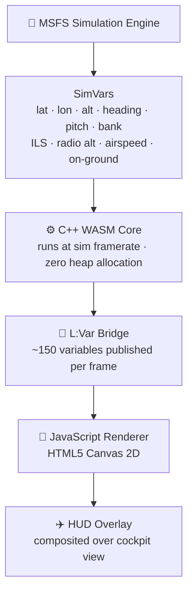
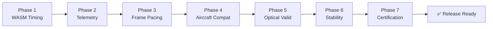

<div align="center">

# ✈ C_HUD_Runway

**Conformal Boeing HGS-style HUD for Microsoft Flight Simulator**

[](https://github.com/leekangmmin/20260529/releases)
[](https://www.flightsimulator.com/)
[](LICENSE)
[](https://github.com/leekangmmin/20260529)
[](https://github.com/leekangmmin/20260529)

[](https://github.com/leekangmmin/20260529/stargazers)
[](https://github.com/leekangmmin/20260529/network)
[](https://github.com/leekangmmin/20260529/commits)

<br/>

[](https://github.com/leekangmmin/20260529/releases/latest/download/C_HUD_Install.exe)

<br/>

<p>
  <a href="#preview">Preview</a> &nbsp;·&nbsp;
  <a href="#the-conformal-difference">Conformal</a> &nbsp;·&nbsp;
  <a href="#cat-iii-capable">CAT III</a> &nbsp;·&nbsp;
  <a href="#how-it-works">Architecture</a> &nbsp;·&nbsp;
  <a href="#installation">Install</a>
</p>

</div>

---

## Preview

<div align="center">
  
</div>

<div align="center">
  <sub>
    <b>FPV</b> Flight Path Vector &nbsp;·&nbsp;
    <b>G/S · LOC</b> ILS confidence bars &nbsp;·&nbsp;
    <b>Runway</b> 8-corner conformal projection &nbsp;·&nbsp;
    <b>Flare cue</b> touchdown director &nbsp;·&nbsp;
    <b>LAND 3 · CAT III</b> mode annunciator
  </sub>
</div>

---

## What is this?

C_HUD_Runway overlays a conformal Boeing HGS 4000-style Head-up Guidance System onto MSFS aircraft. It projects the runway outline, flight path vector, ILS guidance bars, flare cues, and rollout guidance directly onto the cockpit view — using a transparent HTML5 canvas layer synchronized with a C++ WASM simulation core running inside MSFS.

You're on approach in solid instrument conditions. The HUD fires up and a clean outline of the runway appears dead ahead, locked to the pavement. As the aircraft banks onto final, the box rotates in perfect sync — each corner tracking through real perspective math. The ILS bars start dashed when the signal is weak, then solidify as you intercept. Below 200 feet in CAT III fog, the runway is still there. Every symbol carries a faint green afterglow — the same phosphor persistence you'd see through real Collins HGS-4000 combiner glass.

---

## Features at a Glance

<table>
  <tr>
    <td align="center" width="33%">
      <h3>⚙️ WASM Core</h3>
      C++17 · Zero heap allocation<br/>
      Runs at sim framerate<br/>
      Freestanding <code>-nostdlib</code>
    </td>
    <td align="center" width="33%">
      <h3>🛬 CAT III Ready</h3>
      Decision height 0 ft<br/>
      Rollout centerline guidance<br/>
      ILS confidence tracking
    </td>
    <td align="center" width="33%">
      <h3>📡 Live Data Bridge</h3>
      ~150 L:Vars per frame<br/>
      WASM → JavaScript<br/>
      Zero-copy pub/sub
    </td>
  </tr>
  <tr>
    <td align="center" width="33%">
      <h3>🎯 Conformal Projection</h3>
      8-corner perspective math<br/>
      World-locked to real runway<br/>
      Lat/lon/alt/pitch/bank aware
    </td>
    <td align="center" width="33%">
      <h3>💚 Phosphor Persistence</h3>
      Accumulation buffer renderer<br/>
      Collins HGS-4000 afterglow<br/>
      0.55–0.96 decay multiplier
    </td>
    <td align="center" width="33%">
      <h3>🔧 Self-Healing Installer</h3>
      Auto-detects Community folder<br/>
      Timestamped backups<br/>
      One-click repair
    </td>
  </tr>
</table>

---

## Before / After

```
WITHOUT C_HUD_Runway              WITH C_HUD_Runway
─────────────────────             ─────────────────────────────────────
  ┌───────────────────┐             ┌───────────────────────────────┐
  │                   │             │ 350kt ─┤  ┌─────────┐ ├─ FL050│
  │                   │             │        │  │  ●[FPV] │ │       │
  │   (cockpit only)  │             │   ─────┤GS┼─────────┼LOC─────│
  │                   │             │            └─────────┘        │
  │                   │             │        ╱▔▔▔▔▔▔▔▔▔▔▔▔╲        │
  │  No runway cues   │             │      ╱   RUNWAY BOX    ╲      │
  │  No FPV           │             │    ╱  ┌────────────┐     ╲   │
  │  No ILS guidance  │             │   ╱   │ ↕ FLARE CUE│      ╲  │
  │  Hope for the best│             │  ╱────┴────────────┴───────╲ │
  └───────────────────┘             └───────────────────────────────┘
  CAT I only · Visual conditions    CAT III · Zero visibility capable
```

---

## The Approach — Phase by Phase

```
 FL100      FAF        1000ft      200ft       50ft        TD
   │          │           │           │          │          │
   ●──────────●───────────●───────────●──────────●──────────●
   │          │           │           │          │          │
 HUD        ILS         Bars        CAT III    Flare     Rollout
 init      captured    solid        mode       cue fires  guidance
           bars dash→solid         runway box  ↕ pull    centerline
                                   locked in             tracking
```

---

## The Conformal Difference

Most HUD overlays are static — fixed symbols with no connection to the world outside. They don't know where the runway is.

**Conformal means world-locked.** Every symbol is computed from the aircraft's actual position — latitude, longitude, altitude, heading, pitch, bank — read from SimVars each frame. The runway outline is not a picture. It's an 8-corner polygon projected from real 3D coordinates through a full perspective transform onto the 2D screen.

As you fly the approach, the corners converge to a point, rotate with the aircraft, shrink with distance — because they're mathematically attached to the real runway in three-dimensional space. At 200 feet AGL in zero-visibility CAT III fog, the conformal runway outline shows you exactly where the pavement is.

---

## CAT III Capable

CAT III approaches are the most demanding operation in commercial aviation. Decision heights drop to 0 feet. The pilot relies entirely on guidance symbology.

- **Decision height as low as 0 ft** — CAT IIIC approach support
- **Rollout guidance** — centerline tracking continues after touchdown through the landing roll
- **ILS signal confidence tracking** — guidance fades, dims, or oscillates as signal quality degrades
- **Flare director cue** — fires at the exact moment based on radio altitude and descent rate

---

## ILS Confidence Rendering

The ILS guidance bars communicate signal quality continuously through their rendering style — exactly like a real HGS system.

| Signal State | Visual | Meaning |
|---|---|---|
| 🟢 **Solid** | ━━━━━━━━━ | Full signal — intercept established |
| 🟡 **Dimmed** | ▒▒▒▒▒▒▒▒▒ | Marginal — continue with caution |
| 🟠 **Dashed** | ╌╌╌╌╌╌╌╌╌ | Weak — cross-check instruments |
| 🔴 **Oscillating** | ≋≋≋≋≋≋≋≋≋ | Unstable — approaching unreliable |
| ⚫ **Hidden** | *(failure flag shown)* | Signal lost — go-around |

---

## Phosphor Persistence

Real HUD combiners use a phosphor-coated screen. The green glow lingers for ~30–60ms after the beam passes — the characteristic soft afterglow on every symbol.

This addon simulates it using an accumulation buffer: each frame, fade the buffer toward black, draw new symbols, composite onto canvas. Symbols leave a brief green trail as they move. When the runway outline shifts during a bank, it doesn't snap — it glides.

```
Frame N-3  │ ░░░████████░░  (full brightness)
Frame N-2  │ ░░░▓▓▓▓▓▓▓▓░░  (decaying)
Frame N-1  │ ░░░▒▒▒▒▒▒▒▒░░  (fading)
Frame N    │ ░░░░░░░░████░░  (new frame composited on top)
           └──────────────────── time →
```
*Decay multiplier: 0.55–0.96 per frame depending on persistence setting.*

---

## How It Works



| Layer | Technology |
|---|---|
| Simulation core | C++17 WASM, freestanding (`-nostdlib`), sim framerate |
| Aircraft data | 20+ SimVars read per frame via MSFS Gauge API |
| Symbol rendering | HTML5 Canvas 2D, composited over cockpit view |
| Data bridge | ~150 L:Vars published from WASM to JavaScript per frame |
| Stabilization | Exponential Moving Average (EMA) filters on all dynamic symbols |
| Phosphor effect | Accumulation buffer — fade → accumulate → composite |
| Aircraft profiles | 13 aircraft with individual combiner geometry + flare constants |

> The C++ core runs with **zero heap allocation** — every data structure is statically allocated, mirroring real avionics software constraints (ARINC 653). No `malloc`. No `new`. Every byte accounted for at compile time.

---

## Tech Stack


---

## Supported Aircraft

| Aircraft | HUD Style | Status | Profile |
|---|---|---|---|
| 🛫 PMDG 737-800 / 737-700 | Boeing HGS | ✅ | 737 NG combiner geometry |
| 🛫 PMDG 737 MAX | Boeing HGS | ✅ | 737 MAX combiner geometry |
| 🛫 PMDG 777-300ER | Boeing HGS | ✅ | 777 combiner geometry |
| 🛫 Asobo / WT Boeing 787-10 | Boeing HGS | ✅ | 787 combiner geometry |
| ✈️ iniBuilds A350 | Airbus HUD | ✅ | A350 combiner geometry |
| ✈️ FBW A32NX | Airbus HUD | ✅ | A320 combiner geometry |
| ✈️ Headwind A330-900neo | Airbus HUD | ✅ | A330 combiner geometry |
| ✈️ INI A330 | Airbus HUD | ✅ | A330 combiner geometry |
| ✈️ Fenix A320 | Airbus HUD | ✅ | A320 combiner geometry |

---

## Installation

The installer detects MSFS 2020 and 2024 via Windows Registry and `UserCfg.opt`. It creates a timestamped backup of every file it touches before making any changes.

1. Download **C_HUD_Install.exe** from [Releases](https://github.com/leekangmmin/20260529/releases/latest)
2. Run it — MSFS Community folder is detected automatically
3. Click **설치하기**
4. Launch MSFS and fly

> MSFS must be installed before running the installer.  
> Backups are created automatically — one click restores if anything goes wrong.

---

## Certification



✅ **1,241 tests** &nbsp;·&nbsp; **44 test files** &nbsp;·&nbsp; **7 certification phases** &nbsp;·&nbsp; **100% passing**

---

## Requirements

- Microsoft Flight Simulator 2020 or 2024
- Windows 10 / 11 (64-bit)
- A supported aircraft (see table above)

---

## Building from Source

<details>
<summary><strong>Build instructions (developers only)</strong></summary>

**Prerequisites**
```bash
pip install customtkinter pyinstaller
```

**Build installer EXE**
```bash
pyinstaller C_HUD_Install.spec
# Output: dist/C_HUD_Install.exe
```

**WASM build** requires MSFS SDK 0.23+, Clang/WASM toolchain.

</details>

---

## License

MIT — see [LICENSE](LICENSE) file.

<br/>

<div align="center">
  <a href="https://github.com/leekangmmin/20260529/stargazers">⭐ Star this repo if it helped you</a>
  <br/><br/>
  <sub>
    <a href="https://github.com/leekangmmin/20260529">GitHub</a> &nbsp;·&nbsp;
    <a href="https://github.com/leekangmmin/20260529/issues">Issues</a> &nbsp;·&nbsp;
    <a href="https://github.com/leekangmmin/20260529/releases">Releases</a>
  </sub>
  <br/><br/>
  <sub><i>Not affiliated with Collins Aerospace, Boeing, Airbus, PMDG, iniBuilds, FlyByWire, or Microsoft.</i></sub>
</div>
