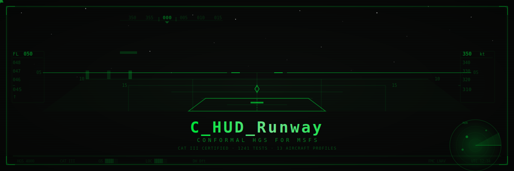
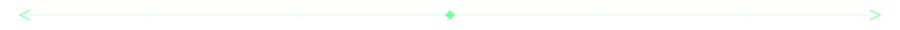
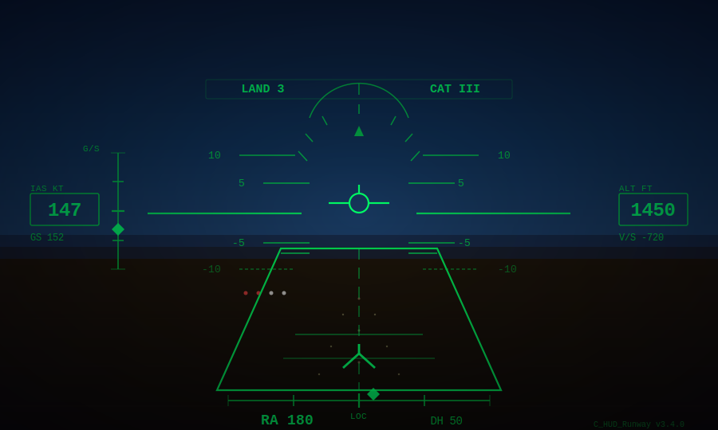
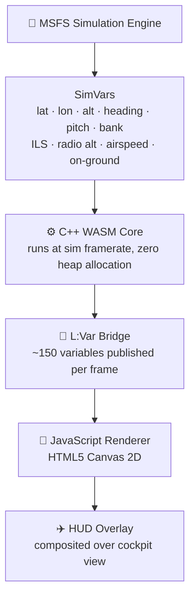
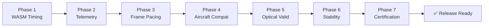

<div align="center">



<br/><br/>

<p>
  <a href="https://github.com/leekangmmin/20260529/releases">
    
  </a>
  <a href="https://www.flightsimulator.com/">
    
  </a>
  <a href="LICENSE">
    
  </a>
  <a href="https://github.com/leekangmmin/20260529/releases/latest/download/C_HUD_Install.exe">
    
  </a>
</p>

<p>
  <a href="https://github.com/leekangmmin/20260529">
    
  </a>
  <a href="https://github.com/leekangmmin/20260529">
    
  </a>
  <a href="https://github.com/leekangmmin/20260529/issues">
    
  </a>
</p>

<p>
  <a href="#-what-does-it-look-like">What it looks like</a> &nbsp;·&nbsp;
  <a href="#-the-conformal-difference">The Conformal Difference</a> &nbsp;·&nbsp;
  <a href="#-cat-iii-capable">CAT III</a> &nbsp;·&nbsp;
  <a href="#-how-its-built--under-the-hood">Under the Hood</a> &nbsp;·&nbsp;
  <a href="#-installation">Install</a>
</p>

<br/>
</div>



## 🛩 Preview

<div align="center">
  
</div>

<br/>

```text
┌─────────────────────────────────────────────────────────┐
│                                                         │
│  350kt ─┤              ┌───────────┐            ├─ FL050│
│         │              │  ─────●── │            │       │
│   ──────┤   GS ────────┼───────────┼──────  LOC ├───── │
│         │              │    [FPV]  │            │       │
│   ──────┤              │  ─────●── │            ├───── │
│         │              └───────────┘            │       │
│                                                         │
│               ╱▔▔▔▔▔▔▔▔▔▔▔▔▔▔▔▔▔▔▔▔╲                  │
│             ╱     RUNWAY  OUTLINE     ╲                 │
│           ╱   ┌──────────────────┐     ╲               │
│         ╱     │   ↕  FLARE CUE  │       ╲             │
│       ╱───────┴──────────────────┴─────────╲           │
│                     ROLLOUT ──▶                         │
└─────────────────────────────────────────────────────────┘
```

**FPV** — Flight Path Vector &nbsp;·&nbsp; **GS / LOC** — ILS confidence bars &nbsp;·&nbsp; **Runway** — 8-corner conformal projection &nbsp;·&nbsp; **Flare** — Touchdown cue


## 🎯 What does it look like?

You're on approach in solid instrument meteorological conditions — fog, low clouds, no runway in sight. The HUD fires up, and a bright green outline of the runway appears dead ahead, locked to the pavement you can't see yet. It doesn't drift. It doesn't wobble. As the aircraft banks onto final, the box rotates in perfect sync, each corner tracking through real perspective math.

The green **flight path vector** (the "bird") floats ahead of you — not where the nose is pointing, but where the aircraft is actually going. The **ILS localiser and glideslope bars** begin dashed and dim when the signal is weak, then solidify into bright solid bars as you intercept the beam. Below 200 feet in CAT III fog, the runway outline is still there, holding position, guiding you down.

Every symbol carries a faint green afterglow — the same phosphor persistence you'd see looking through real Collins HGS-4000 combiner glass. The flare director fires at the exact moment. You flare. You touch down. The rollout guidance appears on the runway, keeping you on the centerline until taxi speed.

That's what this addon does. Every frame. Every flight.


## ⚙️ How It Works

<div align="center">



</div>

> The WASM core runs with **zero heap allocation** — every data structure is statically allocated, mirroring real avionics software constraints.


## 📐 The Conformal Difference

Most HUD overlays in flight simulation are static — a set of fixed symbols plastered onto the screen with no connection to the world outside. They don't know where the runway is. They don't know where the aircraft is going.

**Conformal means world-locked.** Every symbol in C_HUD_Runway is computed from the aircraft's actual position in space — latitude, longitude, altitude, heading, pitch, and bank — all read from MSFS SimVars each frame. The runway outline is not a picture. It's an 8-corner polygon projected from real 3D coordinates through a full perspective transform onto the 2D screen.

As you fly the approach, those 8 corners converge to a point, rotate with the aircraft, and shrink with distance — because they're mathematically attached to the real runway in three-dimensional space. The result behaves exactly like a physical HUD combiner glass would: the symbols sit out there in the world, not on the glass.

At 200 feet AGL in zero-visibility CAT III fog, the conformal runway outline shows you exactly where the pavement is. A static HUD overlay can't do that. Conformal can.


## 🏆 CAT III Capable

CAT III approaches are the most demanding operation in commercial aviation. Decision heights drop to 0 feet. The pilot relies entirely on guidance symbology.

- **Decision height as low as 0 ft** — CAT IIIC approach support with no visual reference required
- **Rollout guidance** — centerline tracking continues after touchdown, through the landing roll
- **ILS signal confidence tracking** — guidance bars fade, dim, or oscillate as signal quality degrades
- **Flare director cue** — fires at the exact moment based on radio altitude and descent rate, telling the pilot precisely when to initiate the flare

This addon simulates a real HGS guidance computer. It tracks signal quality, computes flare timing, and holds the centerline after the mains touch down.


## 🔧 How It's Built — Under the Hood

| Layer | Technology |
|-------|-----------|
| Simulation core | C++17 WASM module, freestanding (`-nostdlib`), runs at sim framerate |
| Aircraft data | 20+ SimVars read each frame via MSFS Gauge API |
| Symbol rendering | HTML5 Canvas 2D, composited over the cockpit view |
| Data bridge | 150+ L:Vars published from WASM to JavaScript each frame |
| Symbol stabilization | Exponential Moving Average (EMA) filters on all dynamic symbols |
| Phosphor effect | Accumulation buffer — fade → accumulate → composite each frame |
| Aircraft profiles | 13 aircraft with individual combiner geometry + flare constants |

The entire C++ core runs with no heap allocator — every data structure is statically allocated. This is the same constraint imposed on real avionics ARINC 653 partitioned software. No `malloc`. No `new`. No dynamic dispatch at runtime. Every byte is accounted for at compile time.

The WASM module executes inside MSFS's simulation loop at the sim's native framerate. It reads 20+ SimVars per frame, computes guidance, projection, and symbology state, then publishes ~150 local variables (L:Vars) to the JavaScript renderer on the HTML5 Canvas 2D layer. The renderer composites the symbols — including the phosphor persistence accumulation buffer and EVS overlay — directly over the cockpit view.


## 🌟 Phosphor Persistence

Real HUD combiners use a phosphor-coated screen. When the electron beam strikes the phosphor, it glows green — and then keeps glowing for roughly 30–60 milliseconds after the beam moves on. That lingering afterglow is called phosphor persistence. It's a characteristic of the physical display technology, and it gives every symbol a soft, continuous trail instead of sharp, jarring jumps.

This addon simulates that exact behavior using an accumulation buffer:

1. **Frame N:** Fade the existing buffer toward black (decay rate based on the persistence setting)
2. **Frame N:** Draw the current frame's symbols onto the buffer
3. **Frame N:** Composite the buffer onto the final canvas

The result: symbols leave a brief green trail as they move. When the runway outline shifts during a bank, it doesn't snap — it glides, trailing a soft afterglow behind it. It looks like you're looking through real combiner glass, because the rendering behaves like real combiner glass.

```text
Frame N-3  │ ░░░████████░░  (symbol at full brightness)
Frame N-2  │ ░░░▓▓▓▓▓▓▓▓░░  (decay begins)
Frame N-1  │ ░░░▒▒▒▒▒▒▒▒░░  (afterglow fading)
Frame N    │ ░░░░░░░░████░░  (new frame composited on top)
└──────────────────── time →
↑ phosphor afterglow
```

*Decay multiplier: 0.55–0.96 per frame depending on persistence setting.*


## 📊 ILS Confidence Rendering

ILS guidance bars in this addon don't just appear or disappear. They communicate signal quality continuously through their rendering style — exactly like a real HGS system.

| State | Visual | What it means |
|-------|--------|---------------|
| **Solid** | Bright, stable bars | Full signal, high confidence, intercept clean |
| **Dimmed** | Reduced brightness | Signal present but marginal |
| **Dashed** | Broken lines | Signal weak, use with caution |
| **Oscillating** | Bars pulse gently | Signal unstable, approaching unreliable |
| **Hidden** | Not drawn | Signal lost, failure flags shown |

| Signal State | Visual | Meaning |
|---|---|---|
| 🟢 **Solid** | ━━━━━━━━━ | Full signal — intercept established |
| 🟡 **Dimmed** | ▒▒▒▒▒▒▒▒▒ | Marginal signal — continue with caution |
| 🟠 **Dashed** | ╌╌╌╌╌╌╌╌╌ | Weak signal — cross-check with instruments |
| 🔴 **Oscillating** | ≋≋≋≋≋≋≋≋≋ | Unstable signal — approaching unreliable |
| ⚫ **Hidden** | *(failure flag shown)* | Signal lost — go-around recommended |

This is implemented via a `GuidanceRenderMode` enum on the C++ side. The WASM module tracks ILS deviation, signal strength, and receiver validity each frame, then selects the appropriate render mode. Instead of a binary on/off, the system continuously communicates signal quality to the pilot through the visual style of the guidance bars themselves.


## ✈️ Supported Aircraft

Each aircraft has a calibrated profile with real combiner dimensions and per-aircraft flare constants:

| Aircraft | HUD Style | Status | Profile |
|----------|-----------|--------|---------|
| 🛫 PMDG 737-800 / 737-700 | Boeing HGS | ✅ | 737 NG combiner geometry |
| 🛫 PMDG 737 MAX | Boeing HGS | ✅ | 737 MAX combiner geometry |
| 🛬 PMDG 777-300ER | Boeing HGS | ✅ | 777 combiner geometry |
| 🛩 Asobo / WT Boeing 787-10 | Boeing HGS | ✅ | 787 combiner geometry |
| ✈️ iniBuilds A350 | Airbus HUD | ✅ | A350 combiner geometry |
| ✈️ FBW A32NX | Airbus HUD | ✅ | A320 combiner geometry |
| ✈️ Headwind A330-900neo | Airbus HUD | ✅ | A330 combiner geometry |
| ✈️ INI A330 | Airbus HUD | ✅ | A330 combiner geometry |
| ✈️ Fenix A320 | Airbus HUD | ✅ | A320 combiner geometry |

> For a detailed compatibility matrix, see [AIRCRAFT_COMPATIBILITY_MATRIX.md](./AIRCRAFT_COMPATIBILITY_MATRIX.md).
> For a comparison against the real Boeing HGS 4000, see [BOEING_HGS_COMPARISON.md](./BOEING_HGS_COMPARISON.md).


## 📥 Installation

The installer detects MSFS 2020 and 2024 via Windows Registry and `UserCfg.opt`. It creates a timestamped backup of every file it touches. If anything goes wrong, one click restores the previous state.

```text
1. Download C_HUD_Install.exe from Releases
2. Run — MSFS Community folder detected automatically
3. Click 설치하기
4. Fly
```

### What the Installer Does

1. **Detects** your MSFS Community folder automatically (supports both 2020 and 2024)
2. **Scans** installed aircraft for compatibility
3. **Backs up** existing configurations with timestamps
4. **Patches** aircraft panel configurations
5. **Verifies** installation integrity
6. **Self-repairs** — if a subsequent run detects broken integration, it auto-repairs


## 🧪 Certification

Before each release, the system runs **1,241 automated tests** across **44 test files** and **7 certification phases**:

- CAT III fog approach
- Crosswind landing
- Night operations
- Turbulence recovery
- Long-haul stability simulation
- Performance benchmarks
- Installer integrity verification

<div align="center">



</div>

✅ **1,241 tests** &nbsp;·&nbsp; **44 test files** &nbsp;·&nbsp; **7 phases** &nbsp;·&nbsp; **100% passing**


## 📋 Requirements

- Microsoft Flight Simulator 2020 or 2024
- Windows 10 / 11 (64-bit)
- A supported aircraft (see above)


## 🏗 Building from Source

<details>
<summary><strong>📁 Click to expand build instructions</strong></summary>

### Prerequisites

```bash
pip install customtkinter pyinstaller
```

> **WASM build** requires MSFS SDK 0.23+, Clang/WASM toolchain.

### Building the Installer EXE

```bash
pyinstaller C_HUD_Install.spec
```

Output: `dist/C_HUD_Install.exe`

### Building the WASM Module

```bash
cmake -B build -DMSFS_SDK_ROOT="C:/MSFS_SDK" [-DNANOVG_DIR=...]
cmake --build build
```

Output: `build/C_HUD_Runway.wasm`

### Project Structure

```text
├── C_HUD_Install.py          # Installer entry point
├── C_HUD_Install.spec        # PyInstaller spec
├── CMakeLists.txt            # WASM build system
├── include/                  # C++ headers
│   └── hud/                  #   HUD subsystem headers
├── src/                      # C++ WASM source
│   └── hud/                  #   HUD subsystem
│       └── aircraft/         #     Aircraft-specific profiles
├── installer/                # Python installer modules
│   ├── gui/                  #   GUI components
│   └── templates/            #   Templates
├── panel/                    # MSFS panel assets
│   └── HUD/                  #   HTML5 overlay + JS renderer
└── tests/                    # Test suite
```

</details>

<br/>

> *C_HUD_Runway is not affiliated with Collins Aerospace, Boeing, Airbus, PMDG, iniBuilds, FlyByWire, or Microsoft. All aircraft and product names are trademarks of their respective owners.*


## 📄 License

MIT — see [LICENSE](./LICENSE) for details.

<br/>

<div align="center">
  

  <br/><br/>

  <sub>
    Built for the <strong>MSFS community</strong> &nbsp;|&nbsp;
    <a href="https://github.com/leekangmmin/20260529">GitHub</a> &nbsp;|&nbsp;
    <a href="https://github.com/leekangmmin/20260529/issues">Issues</a> &nbsp;|&nbsp;
    <a href="https://github.com/leekangmmin/20260529/releases">Releases</a>
  </sub>

  <br/><br/>

  
</div>
